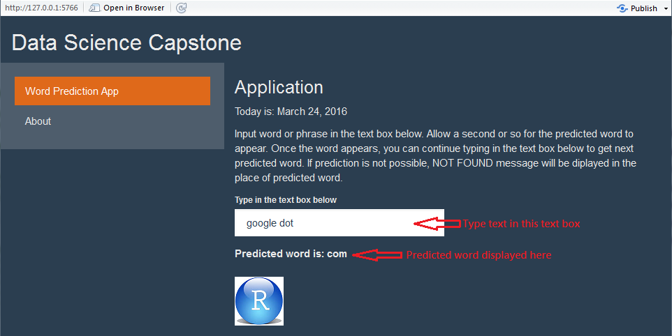

Coursera Data Science Capstone Project
========================================================
author: Aleksey Kramer
date: March 24th, 2016
transition: rotate 

Final project is here: [Shiny Application](www.yahoo.com)

Summary 
========================================================

The Data Science Capstone course offered by Coursera in partnership with John Hopkins University partnered with the SwiftKey, a company that developed one of the most popular word predicting mobile keyboards.

This presentation is developed as part of the Data Science Capstone project. The primary object of the project is to build text predicting Shiny application similar in word predicting functionality to that developed by SwiftKey keyboard.

For this project, the only meansdof delivering develped product is to build a Shiny application that is capable of predicting next word. 

Methods & Models
========================================================

The HC Corpus was created using 15% sample of the data supplied.  The HC Corpous was cleand: all wards converted to lower cas, punctuation removed, links removed, numbers removed, and white space compressed. This HC Corpus was used to generate n-grams.

Unigrams, bigrams, trigrams, and quadgrams were generated and coverted to frequency dictionaries (data frames) of n-grams, containing n-grams and counts of occurances of each n-gram in the Corpus.

The data frames are used to calculate Maximum Likelihood Estimation for the next predicted word based on the text user suppled as input. 

Application
========================================================
The application provides a text box to input the text and displays word prediction as shown on the screenshot of the app below.

References
========================================================
1. [R and Data Science Reference] (https://github.com/lgreski/datasciencectacontent), accessed 03/23/2016
2. [Survival Guied to Data Science with R] (http://togaware.com/onepager/), accessed 03/23/2015
3. [Presentation by M. H. Nierhoff] (https://rpubs.com/nierhoff/cdsc), accessed 03/23/2015
4. [N-Gram tokenizer usage](https://gist.github.com/benmarwick/5370329), accessed 03/23/2015
5. [SwiftKey Word Predicting App](http://54.201.18.67:3838/SwiftKey-Language-Modelling/), accessed 03/23/2015
6. [Word Prediction Presentation](https://www.cs.cornell.edu/courses/CS4740/2012sp/lectures/smoothing+backoff-1-4pp.pdf), accessed 03/23/2015 
7. [RStudio Cheat Sheets](https://www.rstudio.com/resources/cheatsheets/), accessed 03/23/2015

